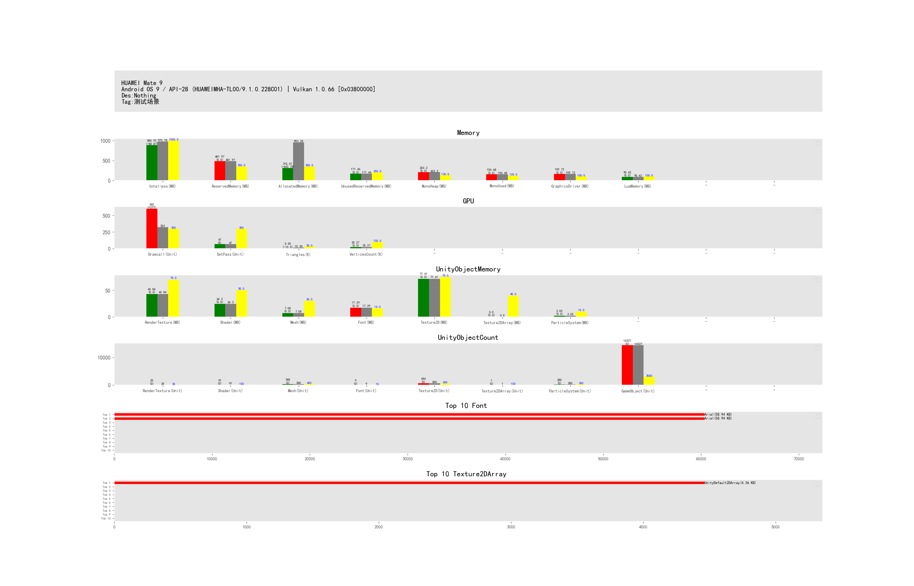

## 
数据采集 PerformanceRecorder.cs
主要注册搜集:


## 数据格式

以文本为例:
```
---[SystemInfo]
HUAWEI Mate 9
Android OS 9 / API-28 (HUAWEIMHA-TL00/9.1.0.228C01) | Vulkan 1.0.66 [0x03800000]

Des:Nothing
Tag:内城 ---[Data]
Memory,total-pss,android total-pss,1,1024000,908202
Memory,ReservedMemory,Total Reserved memory by Unity,0,367001600,505380864
Memory,AllocatedMemory,Allocated memory by Unity,0,367001600,325588248
Memory,UnusedReservedMemory,Reserved but not allocated,0,209715200,179792616
Memory,MonoHeap,Allocated Mono heap size,0,136314880,213065728
Memory,MonoUsed,Mono used size,0,125829120,164290560
Memory,GraphicsDriver,AllocatedMemoryForGraphicsDriver,0,104857600,167483694
Memory,LuaMemory,LuaMemory,1,102400,92593
GPU,Drawcall,Drawcall,2,300,323
GPU,SetPass,SetPass,2,300,67
GPU,Triangles,Triangles,3,30000,15381
GPU,VerticesCount,顶点数量,3,100000,25268
UnityObjectMemory,RenderTexture,Unity RT Size,0,73400320,44922890
UnityObjectMemory,Shader,Unity Shader Size,0,52428800,25480624
UnityObjectMemory,Mesh,Unity Mesh Size,0,31457280,7421174
UnityObjectMemory,Font,Unity Font Size,0,16777216,18133927
UnityObjectMemory,Texture2D,Unity Texture2D Size,0,78643200,75085932
UnityObjectMemory,Texture2DArray,Unity Texture2DArray Size,0,41943040,4464
UnityObjectMemory,ParticleSystem,Unity ParticleSystem Size,0,10485760,2154488
UnityObjectCount,RenderTexture,Unity RT Count,2,30,25
UnityObjectCount,Shader,Unity Shader Count,2,100,97
UnityObjectCount,Mesh,Unity Mesh Count,2,400,348
UnityObjectCount,Font,Unity Font Count,2,10,9
UnityObjectCount,Texture2D,Unity Texture2D Count,2,600,654
UnityObjectCount,Texture2DArray,Unity Texture2DArray Count,2,100,1
UnityObjectCount,ParticleSystem,Unity ParticleSystem Count,2,300,280
UnityObjectCount,GameObject,Unity GameObject Count,2,3000,14327
---[Top]
Top,RenderTexture,Unity RT Count,0,30,[TerrainColorVT=16588800$TempBuffer 17 2048x2048=8388608$Static Shadow Map=3276800$TempBuffer 16 1280x1280=3276800$_CameraColorAttachment0=2910720$_CameraDepthAttachment0=2910720$_CameraColorAttachment1=2910720$Fog Blur 1=1048576$Fog Blur 2=1048576$_RefractionColor=727040$]
Top,Shader,Unity Shader Count,0,100,[CNC_Demo/World/BaseLitOpaqueMask=3358519$CNC_Demo/Particle/Basic 02=2165381$CNC_Demo/UI/UIParticle=1523425$Ecology/UIEffectSystem/UESMovie=1488791$CNC_Demo/World/BaseFoliage=1453919$Hidden/EasyPPS/EasyUber=1418949$Hidden/EasyPPS/EasyUber=1409507$CNC_Demo/World/BaseLitTransparent=1398416$CNC_Demo/World/BaseLitTransparentVT=1171993$CNC_Demo/World/BaseTerrainMeshVT=1007082$]
Top,Mesh,Unity Mesh Count,0,100,[GridMeshNew=1556372$M_GDI_INN_BUILD04_L1_LOD3=974848$M_GDI_INN_BUILD03_L1_LOD3=292056$M_GDI_INN_BUILD02_L1_LOD3=228448$M_GDI_INN_BUILD05_L1_LOD3=177484$M_GDI_INN_BUILD07_L1_LOD3=130488$SM_NEU_OUT_ROCK_Group_LOD_3_0=118148$M_GDI_INN_BUILD09_L1_LOD3=105904$3_9=92536$SM_NOD_OUT_BIGCITYWALL_02 (1)_LOD_2_0=88456$]
Top,Font,Unity Font Count,0,100,[Rajdhani-SemiBold=8831212$Rajdhani-SemiBold=8799532$LiberationSans=352936$wryhztnew_subset=80931$Arial=60356$uishieldsfly=2240$SuperWeapon=2240$uidamagefly=2240$txt_uihealfly=2240$]
Top,Texture2D,Unity Texture2D Count,0,100,[Rajdhani-SemiBold Atlas=2097664$FogOfWar=2097664$OutBuilding_Small=1893880$sactx-0-2048x2048-ASTC 6x6-icon_head_hero_new-5144f4d4=1893880$sactx-2-2048x2048-ASTC 6x6-S_Common-b0b7c073=1893880$sactx-0-2048x2048-ASTC 6x6-icon_item-3dad8bb2=1893880$sactx-0-2048x2048-ASTC 6x6-S_UIWorld-e1c26b87=1893880$sactx-0-2048x2048-ASTC 6x6-S_Common-b0b7c073=1893880$sactx-1-2048x2048-ASTC 6x6-S_Common-b0b7c073=1893880$Inner2D_INN_101=1893880$]
Top,Texture2DArray,Unity Texture2DArray Count,0,100,[UnityDefault2DArray=4464$]
```

目前支持解析:
###  SystemInfo
Tag名固定
以按行读取显示
文本内容参考:
```
---[SystemInfo]
HUAWEI Mate 9
Android OS 9 / API-28 (HUAWEIMHA-TL00/9.1.0.228C01) | Vulkan 1.0.66 [0x03800000]

Des:Nothing
```
对应解析展示：


### Data采样数据
目前每种类别最多支持显示10种类型
按逗号分割
下标代表:
0 ->  类别
1 -> 类型
2 -> 描述信息，暂时没有展示
3-> 数据转换类型  
4-> 最大值
5-> 当前值


数据转换
```
public enum EUnitConversion
{
    UnitByte = 0, //单位 byte
    UnitKb = 1,   //单位 kb
    Unit = 2,     // 数量
    UnitK = 3,    // 千  
}
```

### Top 采样
目前每种类别最多支持显示10种类型
按逗号分割
下标代表:
0 ->  类别
1 -> 类型
2 -> 描述信息，暂时没有展示
3-> 数据转换类型  
4-> 最大值
5-> 当前top数组值， 三个月还有格式 [] 包含分割符 $ 分割数据， = 分割名字及值


文本数据展示参考见附件Test.png

## 其它平台
项目内打包工具内集成可以用UWA,UPR， 不过目前免费使用限制比较多。官网介绍都比较全面


